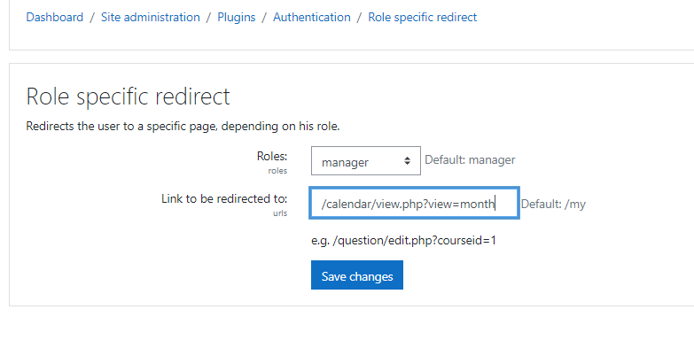
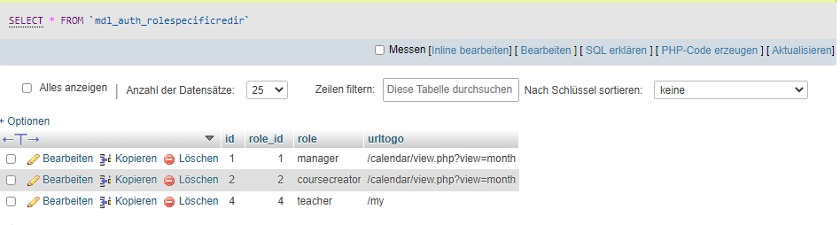
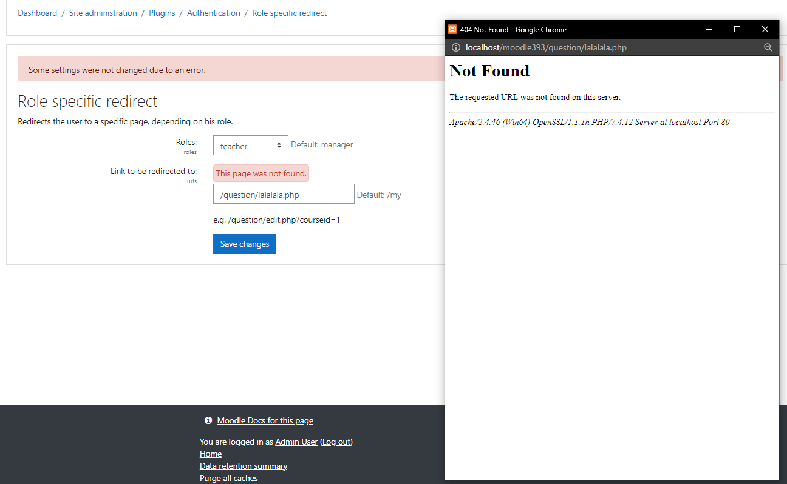
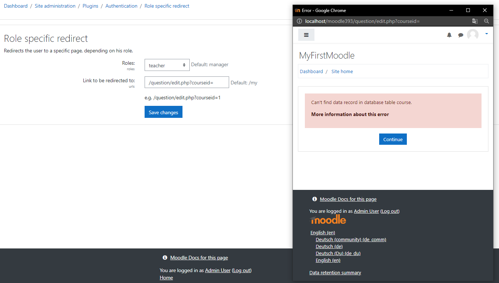
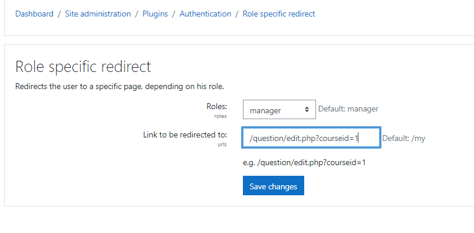
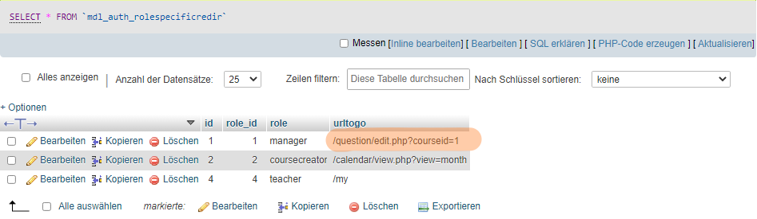

# auth_rolespecificloginredirect

This Moodle Authetication Role Specific Redirect on Login is an extended version of the Authentication with Email for Moodle - Copyright (C) Martin Dougiamas. This new authentication module redirects users with specific roles to specific Moodle page. This functionality was created by Tobias Kutzner and Igor Nesterow (2020) and extended by Eleonora Kostova Copyright (C) 2021.

## Description

The main role of this plugin is to save all roles, which will be used, and the URL paths to be redirected to. Every role has only one path to be redirected to, but this one could be changed anytime from the admin.

The plugin will be enabled when installed, but could be disabled every time by going to **../admin/settings.php?section=manageauths**.

During the installation a new DB table will be created. 

## How to Use and How it Works:

Navigation tipps: ***Site administration -> Plugins -> Plugins Overview -> Authentication methods -> Role specific redirect -> Settings***

**../admin/settings.php?section=authsettingrolespecificloginredirect**

Example: By selecting *manager* we will redirect every user with this role to a specific URL (e.g **../question/edit.php?courseid=1**).

## Creating a readirection path for a specific role

1. Choose a role.
2. Write the path you want this role to be redirected to. (**Better copy a real link so that the redirection princip work really**)
3. Save the changes.

## Choosing specific role and an URL to redirect this role to

## Role and URL saved in the Databank

## **Important!** 

#### It is very important to use only Moodle specific URLs, which really exist. Nevertheless do not forget to proof if the specific role you want to use has also the right to enter the corresponding URL.

## Error message when saving an incorrect URL that does not exist at all.

## Error message when saving an URL that is partially correct. In most cases, these are URLs that contain a specific ID number. These types of URLs are saved in the database, but thanks to the pop-up window, the administrator can see that the specific page contains some errors.

## Update a redirection path for a specific role
1. Choose a role.
2. Write the path you want this role to be redirected to. (**Better copy a real link so that the redirection princip work really**)
   -> If you want this role to be redirected to the Daschboard write down ***/my***
3. Save the changes.

